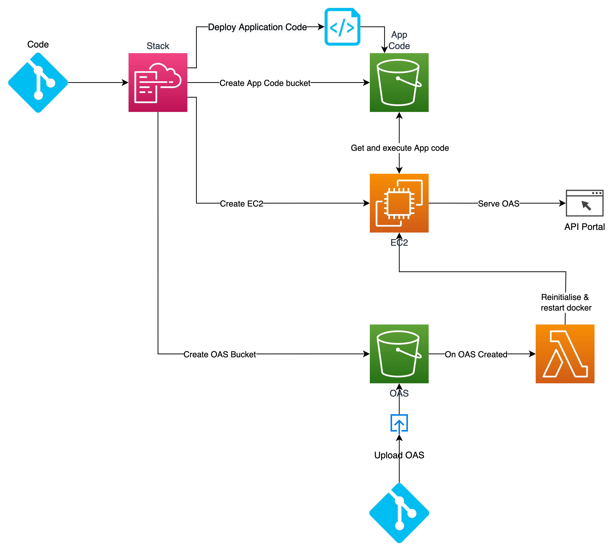

## API Docs Project

This API Documentation Project leverages modern technologies to provide an interactive and user-friendly experience for accessing and visualizing API specifications. Utilizing Swagger UI for presentation, Docker for containerization, and AWS CloudFormation for infrastructure management, the architecture ensures scalability, maintainability, and easy deployment. 

A key feature of this project is its ability to automatically provide a mock server for each uploaded API specification. When a user uploads a specification to S3, an event triggers the system to initialize the corresponding mock server, facilitating testing and development. The project structure is designed to enable seamless integration and collaboration, allowing developers to efficiently manage API documentation while adhering to best practices in software development.

Here is the simplified architectural diagram:



### Getting Started

#### Prerequisites

    Node.js & npm
    AWS CLI configured
    AWS CDK installed globally (npm install -g aws-cdk)

#### Installation

##### Clone the repository:

```bash
git clone https://github.com/your-repo/api-docs.git
cd api-docs
```

##### Install dependencies:

```bash
npm install
```

#### Building the Project

To build the project, run:

```bash
npm run build
```

#### Deploying Infrastructure

Bootstrap AWS CDK (run this only once per AWS environment):

```bash
cdk bootstrap
```

Deploy the infrastructure:

```bash
npm run deploy
```

